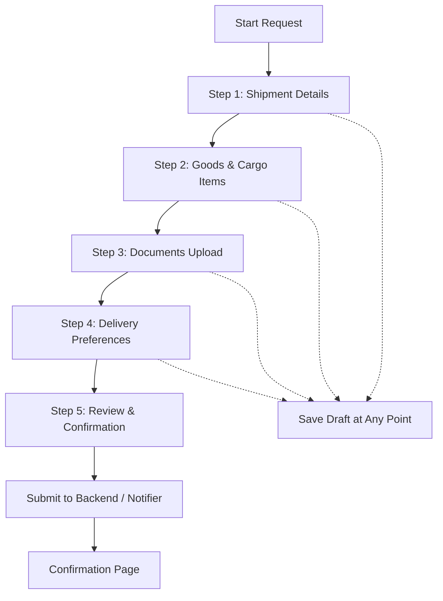

# Customs Clearance Request Flow & API Specification

Comprehensive documentation of the **Request Customs Clearance** flow, form steps, field requirements, and expected JSON payloads in the Hamza RMB mobile application.

---

## 1. Flow Overview & Architecture

The customs clearance submission is implemented as a 5-step stepper in [request_clearance_page.dart](file:///c:/Users/user/Documents/Dev%20Projects/Flutter/hamza_rmb/lib/features/customs_clearance/views/request_clearance_page.dart), managed by [customs_clearance_provider.dart](file:///c:/Users/user/Documents/Dev%20Projects/Flutter/hamza_rmb/lib/features/customs_clearance/presentation/providers/customs_clearance_provider.dart) with state backed by [ClearanceRequestModel](file:///c:/Users/user/Documents/Dev%20Projects/Flutter/hamza_rmb/lib/features/customs_clearance/data/models/clearance_request_model.dart).



### Draft Persistence
- Users can click **Save Draft** in the top AppBar at any step.
- Draft data is serialized via `ClearanceRequestModel.toJson()` with `status: "DRAFT"` and saved to local storage.
- When opening the request page again, draft values are pre-filled automatically.

---

## 2. Step-by-Step Breakdown

### Step 1: Shipment Details (`_buildStep1Shipment`)
Captures shipping method and port entry information.

1. **Shipment Type**: Single selection between `Sea`, `Air`, and `Land`.
2. **Country of Origin**: Dropdown selector (`China`, `Turkey`, `United States`, `United Kingdom`, `United Arab Emirates`, `India`, `Germany`, `Vietnam`, `Other`).
3. **Port / Airport / Border of Entry**: Dynamically filtered based on selected shipment type:
   - **Sea Ports**: `Apapa Port`, `Tin Can Island Port`, `Lekki Deep Sea Port`, `Onne Port (Rivers)`, `Calabar Port`, `Warri Port`, `Other`.
   - **Airports**: `Murtala Muhammed International Airport (Lagos - NAHCO/SAHCO)`, `Nnamdi Azikiwe International Airport (Abuja)`, `Mallam Aminu Kano International Airport (Kano)`, `Port Harcourt International Airport`, `Other`.
   - **Land Borders**: `Seme Border`, `Idiroko`, `Other`.
4. **Current Shipment Status**: Dropdown (`Not shipped yet`, `In transit`, `Arrived in Nigeria`, `At port/terminal`, `Already arrived but not cleared`).
5. **Carrier & Tracking Information**:
   - **Sea**: Shipping Line / Carrier *(Optional)*, Bill of Lading (B/L) Number, Container Number *(Optional)*.
   - **Air**: Airline / Cargo Carrier *(Optional)*, Air Waybill (AWB) Number.
   - **Land**: Waybill / Cross-border Manifest Number.
6. **Estimated Arrival Date (ETA)**: Date picker.
7. **Missing Info Checkbox (`hasMissingShipmentInfo`)**:
   - Label: *"I don't have full shipping or container numbers yet"*.
   - When checked, all carrier tracking fields and ETA are disabled, allowing submission without tracking numbers.

---

### Step 2: Goods Details (`_buildStep2Goods`)
Captures products being imported for customs duty calculation.

1. **Live Header Banner**: Displays total item count and calculates real-time estimated total value:
   $$\text{Total Value} = \sum (\text{quantity} \times \text{purchaseValue})$$
2. **Dynamic Product List**: Can add multiple items (`+ Add Another Item`) or remove existing ones.
3. **Fields per Product Item**:
   - **Product Name / Description**: Free text product identifier.
   - **Category**: Dropdown (`Electronics`, `Fashion & Apparel`, `Auto Parts & Accessories`, `Machinery & Tools`, `Home & Kitchen`, `Health & Beauty`, `Chemicals & Raw Materials`, `Plastics & Rubber`, `General Cargo`).
   - **Quantity**: Numeric count.
   - **Unit**: Dropdown (`pieces`, `cartons`, `pairs`, `sets`, `kg`, `rolls`, `units`, `meters`).
   - **Unit Purchase Value**: Per-item cost.
   - **Currency**: Dropdown (`USD`, `CNY`, `NGN`, `EUR`, `GBP`).
   - **Country of Manufacture**: Defaults to `'China'`.
   - **Estimated Weight (kg)**: Numeric *(Optional)*.
   - **Estimated Volume (CBM)**: Numeric *(Optional)*.
   - **Customs Tariff HS Code**: Harmonized System code *(Optional)*.

---

### Step 3: Documents Upload (`_buildStep3Documents`)
Captures documentation required by Nigerian customs.

1. **Document Categories**:
   - `Commercial Invoice` *(Recommended)*
   - `Packing List` *(Recommended)*
   - `Bill of Lading / Air Waybill` *(Recommended)*
   - `Form M`
   - `PAAR (Pre-Arrival Assessment Report)`
   - `Certificate of Origin`
   - `Import Permits / Product Certificates`
   - `Other Supporting Documents`
2. **Tile Interaction**:
   - **Upload / Camera**: Pick via camera photo or gallery/device file.
   - **"I don't have this" Checkbox (`isNotAvailable`)**: Bypasses document requirement and marks `status: "Not Available"`.
   - Only documents that have been uploaded (`isUploaded == true`) or marked unavailable (`isNotAvailable == true`) are included in the request payload.

---

### Step 4: Post-Clearance Delivery Preferences (`_buildStep4Delivery`)
Specifies destination once cargo receives customs release.

1. **Preference Selection**:
   - **Option A: `Deliver to me`** &rarr; Dispatches cargo to customer's warehouse, store, or residence. Requires full Nigerian delivery address.
   - **Option B: `I'll arrange pickup/delivery myself`** &rarr; Customer arranges self-collection from port/airport gate; `deliveryAddress` payload is `null`.
2. **Delivery Address Fields** (Required when `Deliver to me` is selected):
   - **Full Name / Contact**: Pre-filled from authenticated user profile.
   - **Phone Number**: Pre-filled from authenticated user profile.
   - **Street Address**: Physical delivery location.
   - **City**: Destination city (e.g. `Ikeja`).
   - **State**: Nigerian State dropdown (`Lagos State`, `Abuja (FCT)`, `Ogun State`, etc.).
   - **Special Instructions**: Gate / destuffing / forklift instructions *(Optional)*.

---

### Step 5: Review & Submission (`_buildStep5Review`)
1. **Summary Review Cards**: Grouped summaries of Shipment, Goods, Uploaded Documents, and Delivery. Each card contains an **Edit** button that routes directly to that step.
2. **Accuracy Acknowledgment**: Mandatory checkbox (`_isConfirmedAccurate`):
   > *"I confirm that the information I have provided is accurate to the best of my knowledge."*
3. **Submission**:
   - Submits through `customsClearanceProvider.notifier.submitRequest(requestModel)`.
   - Generates tracking ID (`clr-req-...`) and request number (`CLR-2026-00XXXX`).
   - Moves request to `SUBMITTED` status.
   - Discards active draft and navigates to `ClearanceConfirmationPage`.

---

## 3. Required vs. Optional Fields Matrix

| Section | Field Name | JSON Key | Data Type | Required? | Default / Notes |
| :--- | :--- | :--- | :--- | :--- | :--- |
| **Shipment** | Shipment Type | `shipmentType` | String | **Required** | `'Sea'`, `'Air'`, or `'Land'` |
| **Shipment** | Origin Country | `originCountry` | String | **Required** | Defaults to `'China'` |
| **Shipment** | Port of Entry | `portOfEntry` | String | **Required** | e.g. `'Apapa Port'` |
| **Shipment** | Shipment Status | `shipmentStatus` | String | **Required** | Defaults to `'In transit'` |
| **Shipment** | Shipping Line | `shippingLine` | String? | *Optional* | Sea freight only |
| **Shipment** | Airline | `airline` | String? | *Optional* | Air freight only |
| **Shipment** | Bill of Lading Number | `billOfLadingNumber` | String? | *Conditional* | Recommended for Sea/Land; optional if `hasMissingShipmentInfo` is `true` |
| **Shipment** | Air Waybill Number | `airWaybillNumber` | String? | *Conditional* | Recommended for Air; optional if `hasMissingShipmentInfo` is `true` |
| **Shipment** | Container Number | `containerNumber` | String? | *Optional* | Sea freight only |
| **Shipment** | Estimated Arrival Date | `estimatedArrivalDate` | String? | *Optional* | ISO 8601 string or `null` |
| **Shipment** | Has Missing Info Flag | `hasMissingShipmentInfo`| Boolean | **Required** | `true` if user lacks tracking/container numbers |
| **Goods Item** | Product Name | `productName` | String | **Required** | Item description |
| **Goods Item** | Item Description | `description` | String | *Optional* | Defaults to `""` |
| **Goods Item** | Category | `category` | String | **Required** | Defaults to `'General Cargo'` |
| **Goods Item** | Quantity | `quantity` | Number | **Required** | Minimum `1.0` |
| **Goods Item** | Unit | `unit` | String | **Required** | Defaults to `'pieces'` |
| **Goods Item** | Purchase Unit Value | `purchaseValue` | Number | **Required** | Minimum `0.0` |
| **Goods Item** | Currency | `currency` | String | **Required** | Defaults to `'USD'` |
| **Goods Item** | Country of Manufacture | `countryOfManufacture`| String | **Required** | Defaults to `'China'` |
| **Goods Item** | Estimated Weight (kg) | `weight` | Number? | *Optional* | Numeric or `null` |
| **Goods Item** | Estimated Volume (CBM) | `volume` | Number? | *Optional* | Numeric or `null` |
| **Goods Item** | Tariff HS Code | `hsCode` | String? | *Optional* | String or `null` (e.g. `'8517.62'`) |
| **Documents** | Document Type | `documentType` | String | **Required** | Predefined document name |
| **Documents** | File Name | `fileName` | String | *Conditional* | Empty string if `isNotAvailable: true` |
| **Documents** | File URL / Path | `fileUrl` | String | *Conditional* | Upload URL/path, empty if unavailable |
| **Documents** | Status | `status` | String | **Required** | `'Uploaded'` or `'Not Available'` |
| **Documents** | Is Not Available Flag | `isNotAvailable` | Boolean | **Required** | `true` if customer flagged document missing |
| **Delivery** | Delivery Preference | `deliveryPreference` | String | **Required** | `'Deliver to me'` or `'I\'ll arrange pickup/delivery myself'` |
| **Delivery** | Recipient Full Name | `deliveryAddress.fullName` | String | *Conditional* | **Required** if `'Deliver to me'`, omitted otherwise |
| **Delivery** | Recipient Phone | `deliveryAddress.phone` | String | *Conditional* | **Required** if `'Deliver to me'`, omitted otherwise |
| **Delivery** | Street Address | `deliveryAddress.address` | String | *Conditional* | **Required** if `'Deliver to me'`, omitted otherwise |
| **Delivery** | City | `deliveryAddress.city` | String | *Conditional* | **Required** if `'Deliver to me'`, omitted otherwise |
| **Delivery** | State | `deliveryAddress.state` | String | *Conditional* | **Required** if `'Deliver to me'`, omitted otherwise |
| **Delivery** | Delivery Instructions | `deliveryAddress.instructions` | String? | *Optional* | Extra delivery instructions or `null` |
| **Review** | Confirmation Checkbox | `_isConfirmedAccurate` | Boolean | **Required** | UI validation before form submits |

---

## 4. Final Expected JSON Payload

### Complete Example Payload (Sea Freight + Delivery Requested)

```json
{
  "id": "clr-req-1775059636000",
  "requestNumber": "CLR-2026-001005",
  "customerId": "HZ-88912",
  "shipmentType": "Sea",
  "originCountry": "China",
  "portOfEntry": "Apapa Port",
  "shipmentStatus": "In transit",
  "shippingLine": "COSCO Shipping Lines",
  "airline": null,
  "billOfLadingNumber": "COSU632819001",
  "airWaybillNumber": null,
  "containerNumber": "CSQU3091823",
  "estimatedArrivalDate": "2026-10-15T00:00:00.000Z",
  "hasMissingShipmentInfo": false,
  "status": "SUBMITTED",
  "deliveryPreference": "Deliver to me",
  "deliveryAddress": {
    "fullName": "Bello Al-Hassan",
    "phone": "+234 803 123 4567",
    "address": "Plot 14, Commercial Avenue, Ikeja Industrial Estate",
    "city": "Ikeja",
    "state": "Lagos State",
    "instructions": "Call receiving officer upon arrival at Gate 2"
  },
  "items": [
    {
      "id": "itm-1775059636000-1",
      "clearanceRequestId": "",
      "productName": "Smart Watches & Fitness Trackers",
      "description": "AMOLED touch screen, heart rate sensors, bluetooth calling",
      "category": "Electronics",
      "quantity": 350.0,
      "unit": "pieces",
      "purchaseValue": 24.5,
      "currency": "USD",
      "countryOfManufacture": "China",
      "weight": 120.0,
      "volume": 1.8,
      "hsCode": "8517.62"
    },
    {
      "id": "itm-1775059636000-2",
      "clearanceRequestId": "",
      "productName": "Wireless Noise-Cancelling Earbuds",
      "description": "TWS earbuds with charging case and type-C cables",
      "category": "Electronics",
      "quantity": 500.0,
      "unit": "pieces",
      "purchaseValue": 12.0,
      "currency": "USD",
      "countryOfManufacture": "China",
      "weight": 85.0,
      "volume": 1.2,
      "hsCode": "8518.30"
    }
  ],
  "documents": [
    {
      "id": "doc-invoice",
      "clearanceRequestId": "",
      "documentType": "Commercial Invoice",
      "fileName": "INV-SZ-2026-9081.pdf",
      "fileUrl": "https://storage.hamza-rmb.com/docs/INV-SZ-2026-9081.pdf",
      "status": "Uploaded",
      "uploadedAt": "2026-09-30T17:10:00.000Z",
      "isNotAvailable": false,
      "note": null
    },
    {
      "id": "doc-packing-list",
      "clearanceRequestId": "",
      "documentType": "Packing List",
      "fileName": "PL-SZ-2026-9081.pdf",
      "fileUrl": "https://storage.hamza-rmb.com/docs/PL-SZ-2026-9081.pdf",
      "status": "Uploaded",
      "uploadedAt": "2026-09-30T17:10:00.000Z",
      "isNotAvailable": false,
      "note": null
    },
    {
      "id": "doc-bol",
      "clearanceRequestId": "",
      "documentType": "Bill of Lading / Air Waybill",
      "fileName": "BL_COSU632819001.pdf",
      "fileUrl": "https://storage.hamza-rmb.com/docs/BL_COSU632819001.pdf",
      "status": "Uploaded",
      "uploadedAt": "2026-09-30T17:10:00.000Z",
      "isNotAvailable": false,
      "note": null
    },
    {
      "id": "doc-form-m",
      "clearanceRequestId": "",
      "documentType": "Form M",
      "fileName": "",
      "fileUrl": "",
      "status": "Not Available",
      "uploadedAt": "2026-09-30T17:10:00.000Z",
      "isNotAvailable": true,
      "note": null
    }
  ],
  "charges": [],
  "payments": [],
  "messages": [],
  "statusHistory": [],
  "requiredActionNote": null,
  "createdAt": "2026-09-30T17:10:00.000Z",
  "updatedAt": "2026-09-30T17:10:00.000Z"
}
```

---

### Minimal Example Payload (Self-Pickup + Missing Shipment Numbers)

```json
{
  "id": "clr-req-1775059900000",
  "requestNumber": "CLR-2026-001006",
  "customerId": "HZ-88912",
  "shipmentType": "Air",
  "originCountry": "China",
  "portOfEntry": "Murtala Muhammed International Airport (Lagos - NAHCO/SAHCO)",
  "shipmentStatus": "In transit",
  "shippingLine": null,
  "airline": null,
  "billOfLadingNumber": null,
  "airWaybillNumber": null,
  "containerNumber": null,
  "estimatedArrivalDate": null,
  "hasMissingShipmentInfo": true,
  "status": "SUBMITTED",
  "deliveryPreference": "I'll arrange pickup/delivery myself",
  "deliveryAddress": null,
  "items": [
    {
      "id": "itm-1775059900000-1",
      "clearanceRequestId": "",
      "productName": "Solar Charge Inverters",
      "description": "",
      "category": "Electronics",
      "quantity": 20.0,
      "unit": "units",
      "purchaseValue": 85.0,
      "currency": "USD",
      "countryOfManufacture": "China",
      "weight": null,
      "volume": null,
      "hsCode": null
    }
  ],
  "documents": [
    {
      "id": "doc-invoice",
      "clearanceRequestId": "",
      "documentType": "Commercial Invoice",
      "fileName": "inv.pdf",
      "fileUrl": "local://inv.pdf",
      "status": "Uploaded",
      "uploadedAt": "2026-09-30T17:10:00.000Z",
      "isNotAvailable": false,
      "note": null
    }
  ],
  "charges": [],
  "payments": [],
  "messages": [],
  "statusHistory": [],
  "requiredActionNote": null,
  "createdAt": "2026-09-30T17:10:00.000Z",
  "updatedAt": "2026-09-30T17:10:00.000Z"
}
```
